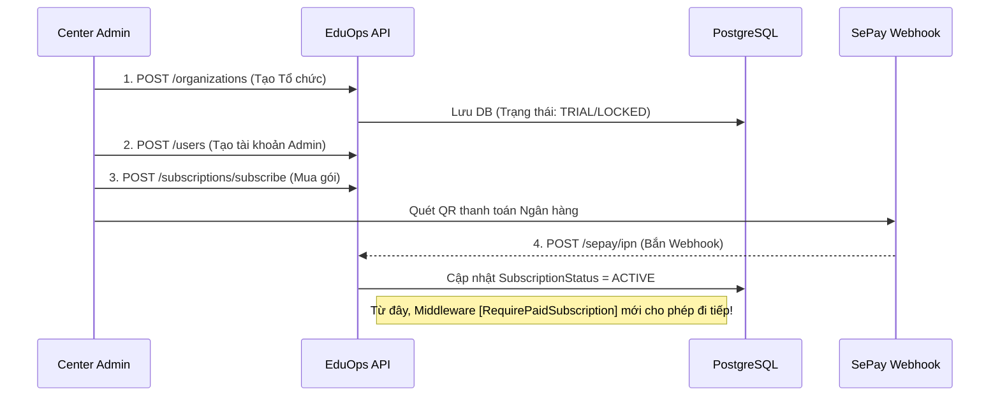
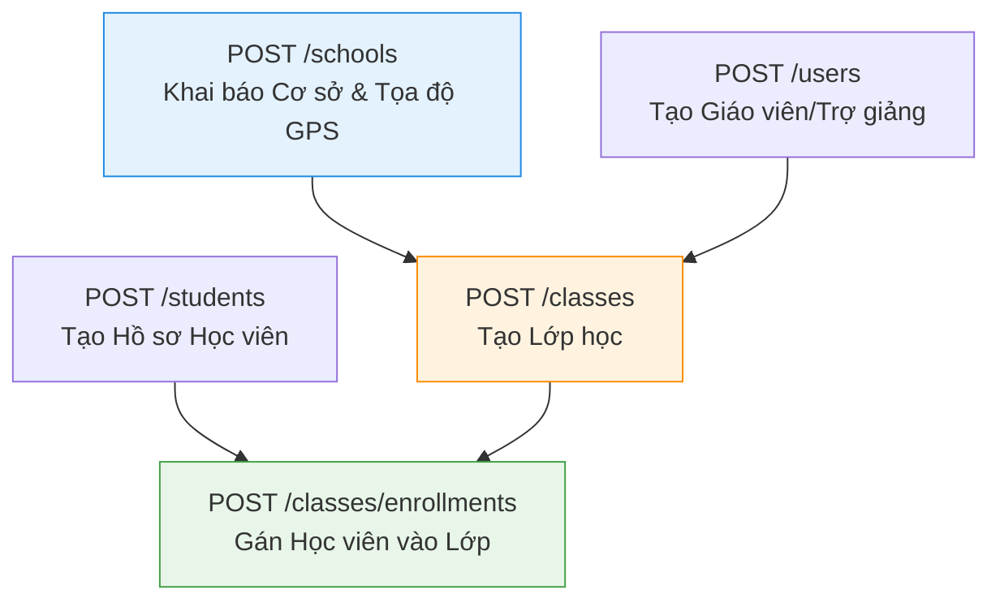
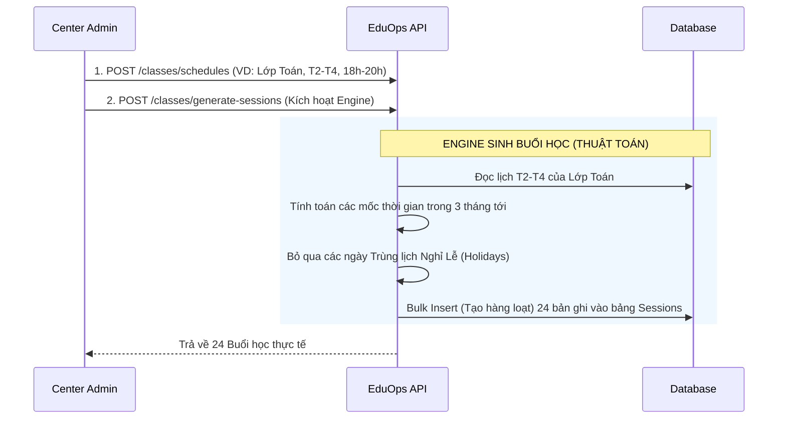
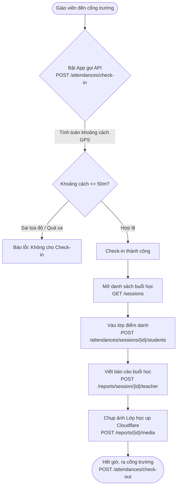

# 📚 TÀI LIỆU CHUẨN: LUỒNG NGHIỆP VỤ & PHÂN CÔNG PHÁT TRIỂN (EDUOPS SAAS)

Tài liệu này là "Kim chỉ nam" (Standard Doc) dành cho Đội ngũ Lập trình viên (Dev A & Dev B). Nó phân tích dòng chảy dữ liệu (Data Flow) xuyên suốt toàn hệ thống và ánh xạ trực tiếp vào 59 API Endpoints hiện có.

---

## PHẦN 1: TỔNG QUAN KIẾN TRÚC & PHÂN CÔNG (ARCHITECTURE & ASSIGNMENT)

Dự án được chia thành 2 Track song song để 2 Lập trình viên code độc lập, không Conflict:

| Track A: System & Billing (Dev A) | Track B: Academic & Operations (Dev B) |
| :--- | :--- |
| **Mục tiêu:** Quản lý tài khoản, thu tiền và vận hành đa trung tâm (Multi-tenant). | **Mục tiêu:** Quản lý giáo dục, lên lịch học và nghiệp vụ điểm danh hàng ngày. |
| - Module 1: Auth (Đăng nhập, Quên MK)   - Module 2: Users (Quản lý Nhân sự)   - Module 3: Organizations (Trung tâm)   - Module 4: Subscriptions & SePay (Dòng tiền)   - Module 5: Profile & Notifications | - Module 6: Schools (Cơ sở vật chất & GPS)   - Module 7: Classes & Students (Học vụ)   - Module 8: Class Schedules (Lên lịch)   - Module 9: Sessions (Sinh buổi học)   - Module 10: Attendances & Reports (Điểm danh) |

---

## PHẦN 2: LUỒNG DỮ LIỆU CHUẨN (STANDARD DATA FLOW)

Hệ thống EduOps vận hành theo một **Quy trình 5 Bước (5-Step Pipeline)** khép kín. Dữ liệu từ Bước 1 bắt buộc phải chảy qua Bước 2, Bước 3... Nếu đứt gãy ở bất kỳ bước nào, toàn bộ hệ thống phía sau sẽ tê liệt.

### BƯỚC 1: KHỞI TẠO & KÍCH HOẠT DÒNG TIỀN (Dev A)
*Điều kiện tiên quyết để hệ thống mở khóa.*

---

### BƯỚC 2: XÂY DỰNG KHUNG HỌC THUẬT (Dev B)
*Thiết lập dữ liệu nền móng của một Trung tâm.*

*Lưu ý cho Dev B: API `POST /schools` đặc biệt quan trọng, bắt buộc phải ép Frontend gửi lên `Latitude` và `Longitude` để phục vụ chức năng Check-in ở Bước 4.*

---

### BƯỚC 3: ĐỘNG CƠ SINH LỊCH HỌC - SCHEDULING ENGINE (Dev B)
*Chuyển đổi từ Lịch tĩnh (Thứ 2, Thứ 4) sang Lịch động (Ngày 15/10, Ngày 17/10).*

*Lưu ý cho Dev B: Đây là API khó code nhất hệ thống, đòi hỏi xử lý vòng lặp thời gian (DateTime) chuẩn xác.*

---

### BƯỚC 4: VẬN HÀNH LỚP HỌC HÀNG NGÀY (Dev B)
*Hoạt động thực tế của Giáo viên tại Cơ sở.*

---

### BƯỚC 5: TỔNG HỢP & THÔNG BÁO (Dev A & Dev B)
*Khép lại vòng đời dữ liệu bằng việc báo cáo cho Giám đốc.*

1. **Dev B:** Khi `POST /attendances/check-out` hoàn tất, gọi hàm `CalculateTeacherSalary()` (nếu có) để tính công.
2. **Dev A:** Trigger API `POST /notifications` đẩy Push Notification về App của Giám đốc Trung tâm: *"Giáo viên Nguyễn Văn A đã hoàn thành báo cáo Lớp Toán cơ bản"*.
3. **Dev A & B:** Phụ huynh / Giám đốc mở API `GET /reports/session/{id}` để đọc báo cáo, xem ảnh và tình trạng điểm danh.

---

## PHẦN 3: BẢNG TIÊU CHUẨN GIAO TIẾP (API CONTRACTS) GIỮA 2 DEV

Vì 2 Dev làm độc lập, cần có những điểm chạm (Integration Points) bắt buộc phải tuân thủ để code ghép lại không bị lỗi:

1. **Chuẩn Multi-Tenant:** 
   - MỌI API `GET`, `PUT`, `DELETE` của Dev B đều không được quyền truyền `OrganizationId` từ Frontend lên.
   - Bắt buộc phải lấy từ `_currentUserService.OrganizationId` trong JWT Token để đảm bảo Trung tâm A không thấy dữ liệu Trung tâm B.
2. **Quyền hạn (Role-based):**
   - Các API tạo Lớp (`POST /classes`), tạo Học viên (`POST /students`) chỉ dành cho `CENTER_ADMIN`.
   - Các API điểm danh (`POST /attendances/...`), Báo cáo (`POST /reports/...`) dành cho `TEACHER` và `ASSISTANT`.
3. **Luật ngầm định (Business Rules):**
   - Giáo viên không thể `Check-out` nếu chưa `Check-in`.
   - Không thể sinh `Sessions` nếu lớp học chưa có `ClassSchedules` và chưa có `Enrollments` (Học viên).
